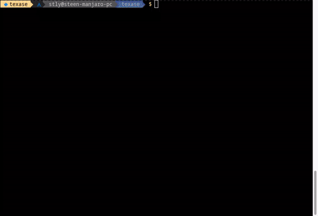

# texase

> Texase is a TUI[^1] for [ASE](https://wiki.fysik.dtu.dk/ase/) databases. It allows you to quickly get an overview and navigate an ASE database.

[^1]: Textual User Interface (Also known as a Terminal/Text User Interface)

> Built with [Textual](https://textual.textualize.io/)

[](https://github.com/steenlysgaard/texase/blob/main/LICENSE)


<!-- [![][versions-image]][versions-url] -->




<!-- ## Screenshots -->

<!--  -->


<!-- ## Installation -->

<!-- Install texase with pip -->

<!-- ```bash -->
<!--   pip install texase -->
<!-- ``` -->

## Usage

After installation do `texase file.db` where `file.db` is your ASE database.

- Press __`?`__ to view all keybindings

- Navigation

Move the cursor with the arrow keys to select different rows and columns.

- Press `Space` to mark a row.

Marking can be used with many subsequent action, e.g. view, export, add/remove key value pairs etc.

- Filter (__`/`__) and search (__`Ctrl-s`__)

Show only rows based on a filter. Search for a certain string/regex, subsequent key presses on `Ctrl-s` moves the cursor to the next match.

- Viewing (__`v`__)

Open the current row or all marked rows with ASE GUI.

- Importing/Exporting trajectories/databases (__`i`__/__`x`__)

Import an external file to the database or save current or all marked rows to a file.

- Add/remove/edit key value pairs (__`k`__/__`d`__/__`e`__)

Manipulate the key value pairs as much as you like. Mind that some key value pairs belonging to the `Atoms` object cannot be changed.

- Press `Enter` and see and modify all the details of a row.

- Adding/removing columns (__`+`__/__`-`__)

Remove the column of the current cursor with `-` and add columns not shown with `+`. Columns can also be added by clicking the corresponding key at the bottom of the screen. Chosen columns are saved between invocations of the same database.

- Deleting rows (__`#`__)
- Suspend the app (__`Ctrl-z`__)

This keeps the texase with the database loaded in memory and returns to the command line. The app can be brought back to focus with `fg`. It is possible to suspend more invocations of texase and selectively bring them to the foreground.

## Background

I use the database in ASE a lot. The command line interface `ase db` could slow me down a bit though when I wanted to check out the results of some calculations and then view a structure or get some output in another way. I would normally go:
- `ase db file.db`
- `ase db -L 0 file.db`
- `ase db -s energy file.db`
- `ase gui file.db@id=32`

Now I can just do `texase file.db` and navigate with single key presses.


## License

[MPL](https://github.com/steenlysgaard/texase/blob/main/LICENSE)


<!-- ## Badges -->

<!-- Add badges from somewhere like: [shields.io](https://shields.io/) -->
